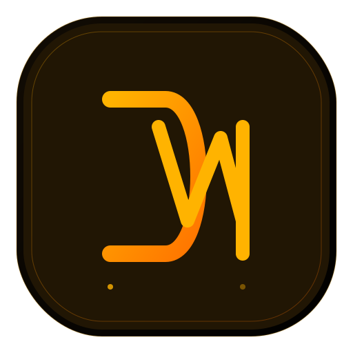
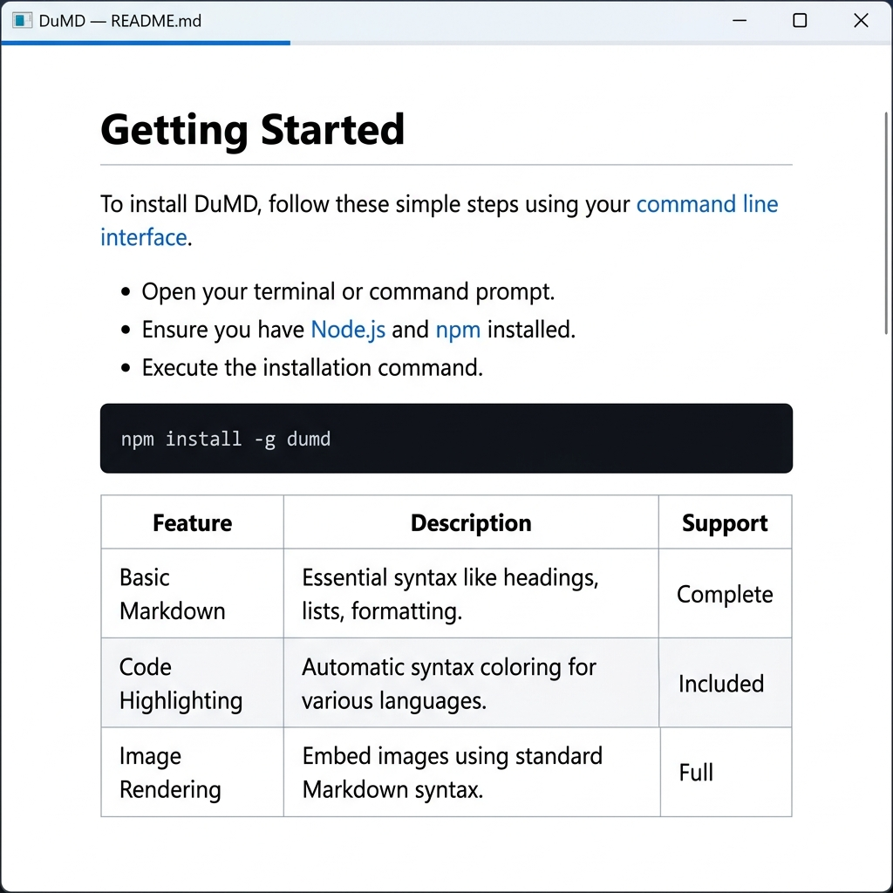
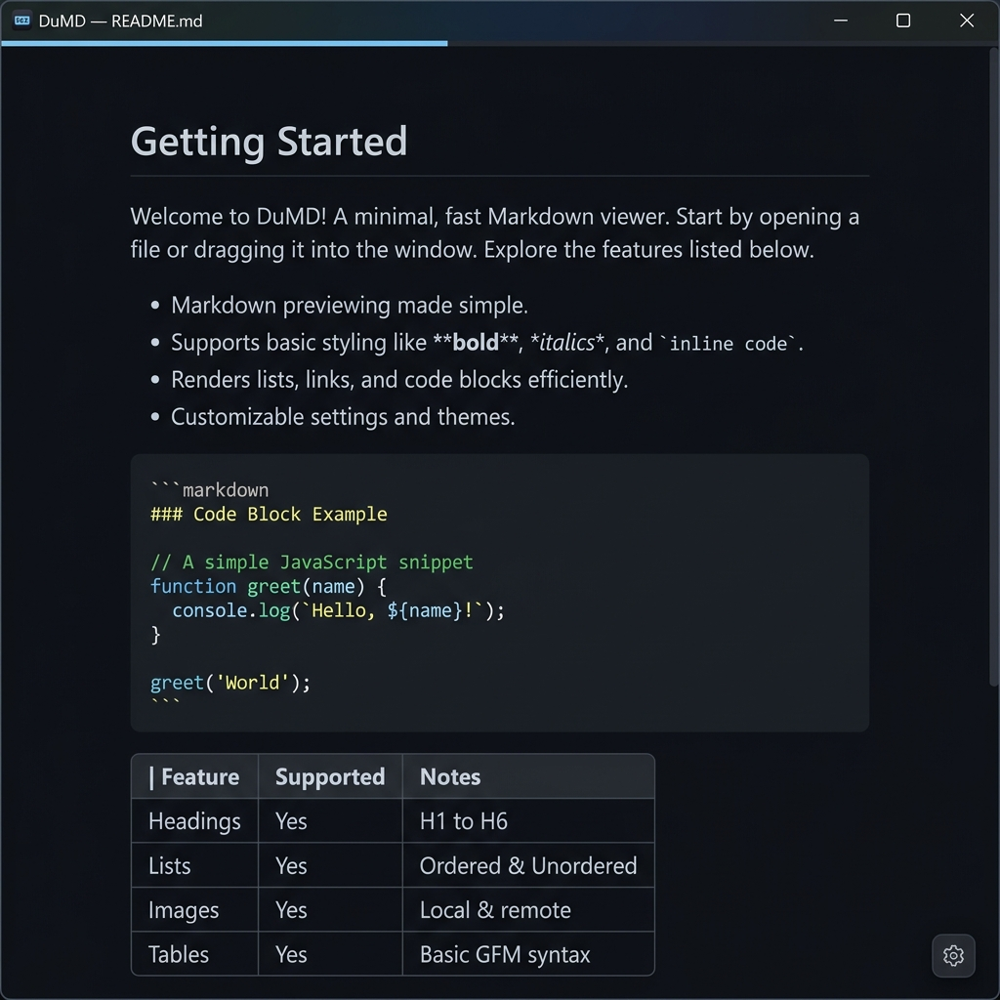
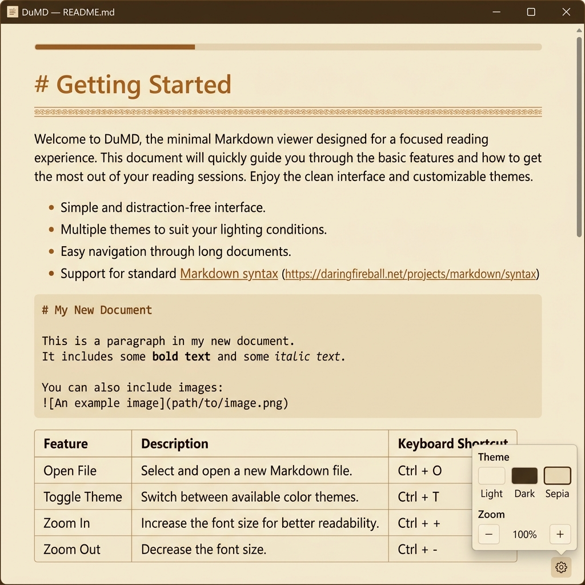

<p align="center">
  
</p>

<h1 align="center">DuMD</h1>

<p align="center">
  <strong>An ultra-minimalist, keyboard-driven desktop Markdown viewer.</strong>
</p>

<p align="center">
  <a href="#installation">Installation</a> •
  <a href="#usage">Usage</a> •
  <a href="#features">Features</a> •
  <a href="#keyboard-shortcuts">Shortcuts</a> •
  <a href="#themes">Themes</a> •
  <a href="#development">Development</a> •
  <a href="#building">Building</a>
</p>

---

## About

**DuMD** is a lightweight desktop application whose sole purpose is to render local Markdown files beautifully. Built with [Wails v2](https://wails.io) (Go backend + vanilla JavaScript frontend), it ships as a **single executable** with no external runtime dependencies.

Designed for users who value **minimalism**, **keyboard efficiency** (Vim-inspired navigation), and **ease of distribution** — just download, double-click, and read.

### Why DuMD?

- 🪶 **Featherweight** — Binary under 18 MB, idle RAM under 60 MB
- ⌨️ **Keyboard-first** — Vim-style scrolling, spacebar page navigation, single-key theme switching
- 🎨 **Three reading themes** — Light, Dark, and Sepia
- 📦 **Zero dependencies for end users** — No Node.js, no Python, no installers
- 🖥️ **Cross-platform** — Windows (x64), macOS (ARM + Intel), Linux (x64)

## Screenshots

<p align="center">
  
  <br/>
  <em>Light Theme — Clean and crisp for daytime reading</em>
</p>

<p align="center">
  
  <br/>
  <em>Dark Theme — GitHub Dark inspired, easy on the eyes at night</em>
</p>

<p align="center">
  
  <br/>
  <em>Sepia Theme — Warm reading tone with the settings panel open</em>
</p>

## Installation

### Download a Release

Download the pre-built binary for your platform from the [Releases](https://github.com/ebdonato/dumd/releases) page.

| Platform | Architecture | File                |
| -------- | ------------ | ------------------- |
| Windows  | x64          | `dumd.exe`          |
| macOS    | ARM (M1/M2+) | `dumd-darwin-arm64` |
| macOS    | Intel        | `dumd-darwin-amd64` |
| Linux    | x64          | `dumd-linux-amd64`  |

### Build from Source

See the [Building](#building) section below.

## Usage

Open any `.md` file from your terminal:

```bash
dumd README.md
```

```bash
dumd path/to/document.md
```

If launched without a file argument, DuMD displays a welcome screen with usage instructions.

### How It Works

1. DuMD reads the Markdown file path from the command-line argument
2. The Go backend parses the Markdown into semantic HTML using [Goldmark](https://github.com/yuin/goldmark) (CommonMark-compliant)
3. The rendered HTML is displayed in a native WebView with GitHub-style typography
4. Theme and zoom preferences are persisted in `localStorage` across sessions

### Link Handling

- **External links** (`http://`, `https://`) — open in your default browser
- **Relative `.md` links** — open in a new DuMD window
- **Anchor links** (`#section`) — scroll within the document

## Features

| Feature                   | Description                                                                |
| ------------------------- | -------------------------------------------------------------------------- |
| **Markdown Rendering**    | Full CommonMark support with GFM table extensions via Goldmark             |
| **Three Themes**          | Light, Dark (GitHub Dark), and Sepia — switchable via keyboard or GUI      |
| **Zoom Control**          | Adjustable font size from 80% to 150% in 10% increments                    |
| **Progress Bar**          | Thin accent-colored bar at the top showing scroll position                 |
| **Vim Navigation**        | `j`/`k` for line scrolling, `h`/`l` for horizontal, `g`/`G` for top/bottom |
| **Speed Reading**         | `Space`/`Shift+Space` for smooth 80%-viewport page scrolling               |
| **Settings Popover**      | Floating gear button (bottom-right) with theme and zoom controls           |
| **Persistence**           | Theme and zoom preferences saved in `localStorage`                         |
| **Single Binary**         | All frontend assets embedded in the Go executable via `go:embed`           |
| **Native Window Frame**   | Uses OS-native window decorations on every platform                        |
| **Cross-file Navigation** | Relative `.md` links open in a new DuMD instance                           |

## Keyboard Shortcuts

Keyboard control is a top priority. All shortcuts work when the document content is focused.

### Navigation

| Key               | Action                                    |
| ----------------- | ----------------------------------------- |
| `Space`           | Scroll down by 80% of the viewport height |
| `Shift` + `Space` | Scroll up by 80% of the viewport height   |
| `j`               | Scroll down (line by line)                |
| `k`               | Scroll up (line by line)                  |
| `h`               | Scroll left (useful for wide code blocks) |
| `l`               | Scroll right                              |
| `g`               | Jump to top of document                   |
| `G`               | Jump to bottom of document                |

### Application

| Key          | Action                                     |
| ------------ | ------------------------------------------ |
| `Esc`        | Close settings popover, or quit the app    |
| `q`          | Quit the application                       |
| `t`          | Cycle theme (Light → Dark → Sepia → Light) |
| `Ctrl` + `=` | Zoom in                                    |
| `Ctrl` + `-` | Zoom out                                   |

> **Note:** On macOS, use `Cmd` instead of `Ctrl` for zoom shortcuts.

## Themes

DuMD ships with three carefully designed reading themes. Your selection is persisted across sessions.

### Light (Default)

A clean white background with dark text, inspired by GitHub's readme styling. Accent color is a crisp blue.

### Dark

A high-contrast dark theme inspired by GitHub Dark. Deep background (`#0d1117`) with soft gray text and light blue accent links. Perfect for night reading.

### Sepia

A warm parchment tone (`#f4ecd8`) with brown typography. Designed for long, comfortable reading sessions reminiscent of book pages.

### Settings Panel

Hover over the **bottom-right corner** of the window to reveal a floating gear button. Click it to open the settings popover with:

- **Theme selector** — Three buttons with color swatches (Light, Dark, Sepia)
- **Zoom controls** — Minus/Plus buttons with a percentage label (80% – 150%)

## Architecture

DuMD uses a hybrid architecture: a **Go backend** handles file I/O and Markdown parsing, while a **vanilla JavaScript frontend** manages the UI and keyboard interactions. The two communicate via Wails' bidirectional IPC.

```text
┌─────────────────────────────────────────────────────────┐
│                    OS Window Frame                      │
│  ┌───────────────────────────────────────────────────┐  │
│  │  Frontend (HTML / CSS / Vanilla JS)               │  │
│  │                                                   │  │
│  │  • Keyboard event capture (Vim / Space / ESC)     │  │
│  │  • Styled HTML rendering (GitHub-style)           │  │
│  │  • Theme management (Light, Dark, Sepia)          │  │
│  │  • Zoom adjustment (80% – 150%)                   │  │
│  │  • Progress bar tracking                          │  │
│  └─────────────────────┬─────────────────────────────┘  │
│                        │  Wails IPC (bidirectional)     │
│  ┌─────────────────────▼─────────────────────────────┐  │
│  │  Go Backend                                       │  │
│  │                                                   │  │
│  │  • File I/O (read .md from CLI arg)               │  │
│  │  • Markdown → HTML (Goldmark + GFM Tables)        │  │
│  │  • Window control (close, title)                  │  │
│  │  • External link delegation (OS browser)          │  │
│  │  • Cross-file navigation (spawn new instance)     │  │
│  └───────────────────────────────────────────────────┘  │
└─────────────────────────────────────────────────────────┘
```

### Native WebView Engines

| Platform | WebView Engine                     |
| -------- | ---------------------------------- |
| Windows  | Microsoft Edge WebView2 (Chromium) |
| macOS    | WebKit (WKWebView)                 |
| Linux    | WebKitGTK                          |

## Development

### Prerequisites

| Tool                                                           | Version  | Purpose                          |
| -------------------------------------------------------------- | -------- | -------------------------------- |
| [Go](https://go.dev/dl/)                                       | ≥ 1.23   | Backend compilation              |
| [Node.js](https://nodejs.org/)                                 | ≥ 18 LTS | Frontend build (Vite)            |
| [Wails CLI](https://wails.io/docs/gettingstarted/installation) | v2       | Orchestrates Go + frontend build |

### Install the Wails CLI

```bash
go install github.com/wailsapp/wails/v2/cmd/wails@latest
```

Verify the installation:

```bash
wails doctor
```

### Clone and Run

```bash
git clone https://github.com/ebdonato/dumd.git
cd dumd
```

Install frontend dependencies:

```bash
cd frontend
npm install
cd ..
```

Start the development server with live reload:

```bash
wails dev
```

This will:

1. Build the Go backend
2. Start the Vite dev server for the frontend
3. Open the application window with hot-reload enabled

> **Important:** Do **not** use `go build` directly. Wails orchestrates the Go compile, Vite frontend build, and asset embedding.

### Project Structure

```text
dumd/
├── main.go                  # Entry point — embeds frontend/dist, parses CLI args
├── app.go                   # Business logic — Markdown rendering, window control
├── wails.json               # Wails project config (window size, build scripts)
├── go.mod / go.sum          # Go module dependencies
│
├── frontend/                # Frontend (embedded via go:embed at build time)
│   ├── index.html           # Single-page HTML shell
│   ├── package.json         # npm config (Vite dev dependency)
│   ├── vite.config.js       # Vite bundler configuration
│   └── src/
│       ├── main.js          # Keyboard handling, theme/zoom logic, Wails IPC calls
│       ├── style.css        # All styles — themes, typography, settings panel, progress bar
│       └── assets/
│           └── logo.svg     # Application logo (DM monogram with amber glow)
│
├── build/                   # Build assets and platform configs
│   ├── appicon.png          # Source icon for all platforms
│   ├── darwin/              # macOS-specific plist files
│   └── windows/             # Windows manifest, icon, installer configs
│
└── docs/                    # Documentation and design files
    ├── spec.md              # Full technical specification
    └── screenshots/         # README screenshots
```

### Go Backend API

The `App` struct in [app.go](app.go) exposes the following methods to the frontend via Wails bindings:

| Method                              | Description                                                      |
| ----------------------------------- | ---------------------------------------------------------------- |
| `GetRenderedMarkdown() string`      | Reads the `.md` file and returns rendered HTML via Goldmark      |
| `CloseApp()`                        | Quits the application                                            |
| `OpenInBrowser(url string)`         | Opens an external URL in the system's default browser            |
| `OpenLocalMarkdown(relPath string)` | Resolves a relative `.md` path and opens it in a new DuMD window |

### Key Dependencies

| Dependency                                   | Role                                       |
| -------------------------------------------- | ------------------------------------------ |
| [Wails v2](https://wails.io)                 | Desktop app framework (Go + WebView)       |
| [Goldmark](https://github.com/yuin/goldmark) | CommonMark-compliant Markdown parser       |
| [Vite](https://vitejs.dev)                   | Frontend bundler (dev server + production) |

## Building

### Production Build (Current Platform)

```bash
wails build -clean -ldflags "-s -w"
```

The `-ldflags "-s -w"` flags strip debug symbols and DWARF information, reducing the binary size by ~30–40%.

The output binary is placed in `build/bin/`.

### Cross-Platform Builds

```bash
# Windows (from any platform with cross-compilation set up)
GOOS=windows GOARCH=amd64 wails build -clean -ldflags "-s -w"

# macOS ARM (Apple Silicon)
GOOS=darwin GOARCH=arm64 wails build -clean -ldflags "-s -w"

# macOS Intel
GOOS=darwin GOARCH=amd64 wails build -clean -ldflags "-s -w"

# Linux
GOOS=linux GOARCH=amd64 wails build -clean -ldflags "-s -w"
```

### Performance Targets

| Metric         | Target  |
| -------------- | ------- |
| Binary size    | < 18 MB |
| Idle RAM usage | < 60 MB |

## Contributing

Contributions are welcome! Here's how to get started:

1. Fork the repository
2. Create a feature branch (`git checkout -b feature/my-feature`)
3. Make your changes
4. Test locally with `wails dev`
5. Commit and push (`git push origin feature/my-feature`)
6. Open a Pull Request

### Constraints to Keep in Mind

- Frontend must remain **vanilla JS** — no framework bundles (React, Vue, Angular)
- Binary must stay under **18 MB**
- Idle RAM must stay under **60 MB**
- Never edit files in `frontend/wailsjs/` — they are auto-generated by Wails

## License

This project is open source. See the repository for license details.

---

<p align="center">
  Made with 💛 by <a href="https://github.com/ebdonato">Eduardo Donato</a>
</p>
